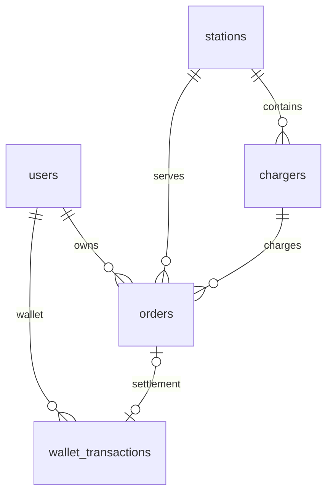

# 数据库架构设计

数据库版本 `PRAGMA user_version = 2`，结构唯一来源为 `database/schema.sql`，编译为后端
Qt资源。只由 `charging-server` 创建和访问 `data/platform.db`；GUI、大屏和Python预测
均通过接口/JSON使用数据。

## 表与关系

| 表 | 主键/关键字段 | 作用 |
| --- | --- | --- |
| users | id、唯一phone、nickname、avatar_url、balance_cents、status | 用户、整数分钱包与冻结状态 |
| admins | id、唯一username、salt、password_hash | 默认管理员与PBKDF2密码 |
| stations | id、唯一code、地址、经纬度、price_cents | 电站与统一单价 |
| chargers | id、station_id、唯一code、type、power_kw、status、计数器 | 设备状态及累计充电信息 |
| orders | id、唯一order_no、user/station/charger_id、状态、起充快照、金额 | 预约到结算的统一订单 |
| wallet_transactions | id、user_id、唯一order_id、kind、amount_cents、前后余额 | 充值/消费流水与余额对账 |
| requests | principal + action + key 联合主键、payload、response | 持久化写操作幂等 |
| audit_logs | id、actor、action、target、detail、created_at | 操作追踪与大屏业务动态 |
| forecasts | 固定id=1、payload | 最近一次完整预测JSON |

订单冗余保存站名、桩编号、类型、功率和价格，形成历史小票快照。外键用于业务实体一致
性，当前不提供删除操作，避免破坏历史记录。头像文件存在 `data/uploads`，表中保存
相对URL；预测结果用一个JSON快照原子替换，以避免读到部分站点的新旧混合预测。

## 约束与事务

`one_active_order_user` 是部分唯一索引，约束用户的 reserved / charging / pending_payment；
`one_occupant_charger` 约束桩的 reserved / charging。预约和钱包请求先 `BEGIN IMMEDIATE`，
同一事务内检查状态、执行变更、写审计及请求结果。结算使用订单唯一消费流水防止重复
扣款。模拟充电计时器也通过事务更新，网络请求和定时器在同一工作线程顺序执行。

钱包要求 SQLite `typeof(balance_cents)='integer'` 且非负；流水要求
`balance_after = balance_before + amount_cents`。API 金额参数检查整数、有限数值和范围；显示层将分转换为元。

故障/离线/重启与占用状态互斥。管理端不能重启或标记正在预约/充电的设备。停止释放设备
与更新订单/计数器原子完成；付款只影响钱包和订单，不能再次累计设备计数。

## 初始化与备份

首次启动一个新目录时，结构、管理员、可选种子在同一事务创建。默认种子是固定随机种子
生成的五站三十桩及相对当前日期的近35天历史会话，故各日首次初始化的订单数可能不同。
演示账户先有模拟初始充值，再逐笔扣除历史消费；流水按id插入顺序对账，历史时间只用于
统计。演示数据不会混入公开嘉兴数据回测。

`--no-seed` 创建空业务库与默认管理员；之后重启该目录不会自动补演示数据。服务在打开数据库时检查结构版本。

备份时先正常停止服务，复制整个数据目录，包含头像与本机配置。运行中
备份应用 SQLite backup API / `.backup`，不要只复制处于WAL模式的主db文件。恢复到新的
目录后用 `--data-dir` 启动。演示重置可指定新的数据目录。

SQL 数据值全部通过 `prepare()` / `addBindValue()` 传入；构建期内嵌结构与后台固定聚合
查询不接受任意客户端SQL。数据库封装见 `apps/server/Database.h`，客户端调用见[接口契约](接口契约.md)。
